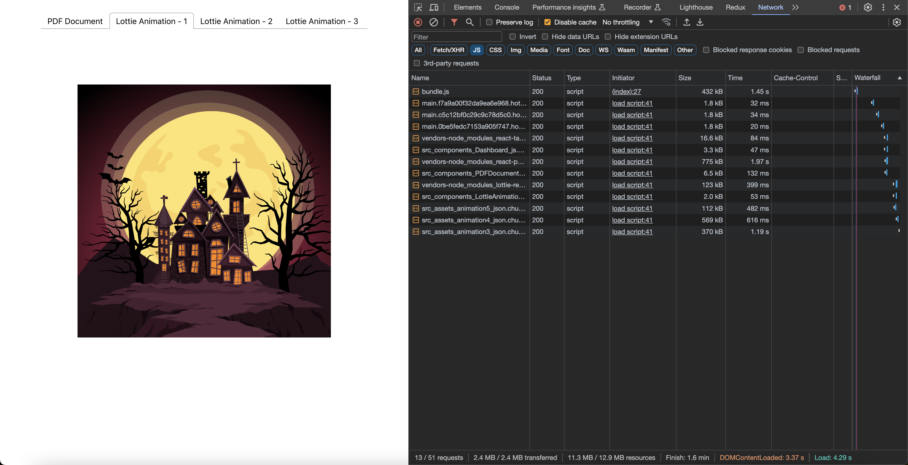

# Code-Splitting-Demo

## Normal Strategy
Bundle size on fresh initial load - 2.4 MB
 

 

 

## With Code Splitting Strategy
Optimized bundle size on fresh initial load - 432 KB
 

 

The rest of the js bundle is downloaded based on user demand for the respective tab's content.
 

